# termtosvg (Rust port)

**THIS IS A PROTOTYPE PORT. DOCUMENTATION MAY BE INCORRECT AND API FUNCTIONALITY MAY BE DIFFERENT THAN EXPECTED. USE AT YOUR OWN RISK.**

I am uploading this to crates.io as a test commit to simply see if the following SVG renders in an animated fashion there.

This is ported from the original [Python code](https://github.com/nbedos/termtosvg), and uses a custom test harness to verify the outputs match up.



This crate is a clean-room Rust reimplementation of the original Python
[termtosvg](https://github.com/nbedos/termtosvg). It records an interactive
terminal session and renders it to a standalone SVG animation (or a still
frame) using the same SVG templates shipped with the upstream project.

## Quick start

Record a session and emit an SVG in one step (defaults to the `powershell`
template):

```sh
cargo run -- --output demo.svg
```

Record only, keeping the asciicast for later:

```sh
cargo run -- record --output prompt_longline.cast
```

Render an existing asciicast with a specific template and still frame mode:

```sh
cargo run -- render tests/data/prompt_longline.cast --template window_frame --still-frames --output window_frame.svg
```

Pipe any command into `termtosvg` and it will render the incoming text (ANSI
colors included) without spawning a child shell:

```sh
neofetch | cargo run -- --screen-geometry 82x24 --output neofetch.svg
```

To render an asciicast streamed on stdin, pass `-` as the input file:

```sh
cat tests/data/prompt_longline.cast | cargo run -- render - --output piped.svg
```

### Rendering from stdin (examples)

You can render asciicast data streamed on stdin using the `render -` form:

```sh
# render an asciicast file piped to stdin
cat tests/data/prompt_longline.cast | cargo run -- render - --output piped.svg

# or with an installed binary
cat tests/data/prompt_longline.cast | termtosvg render - -o piped.svg
```

If you pipe raw terminal output (not an asciicast) into the program without
using the `render` subcommand, the Rust binary will treat the bytes on stdin
as raw terminal output and render a single `o` event containing that data.
This is convenient for single-shot captures where you don't have a cast file:

```sh
neofetch | cargo run -- --screen-geometry 82x24 --output neofetch.svg
```

To explicitly force parsing stdin as an asciicast when piping into the default
invocation, use `/dev/stdin` as the input filename for compatibility with the
original Python implementation:

```sh
cat tests/data/prompt_longline.cast | termtosvg render /dev/stdin -o piped.svg
```

`--template` accepts either a built-in template name (no `.svg` extension) or a
path to a custom SVG template.

## Templates

The original templates are vendored under `old.python/termtosvg/data/templates`
and embedded in the binary via `include_dir!`. The following template names are
available out-of-the-box (all of them are pure SVG/CSS animations that remain
GitHub-safe):

- `base16_default_dark`
- `dracula`
- `gjm8`
- `gjm8_play`
- `gjm8_single_loop`
- `powershell`
- `progress_bar`
- `putty`
- `solarized_dark`
- `solarized_light`
- `terminal_app`
- `ubuntu`
- `window_frame`
- `window_frame_powershell`
- `xterm`

The legacy `window_frame_js` template relied on the Web Animations API and
inline JavaScript. GitHub strips those scripts, so it is no longer bundled nor
supported by the Rust renderer.

### Using a built-in template by name

```sh
cargo run -- render tests/data/prompt_longline.cast --template solarized_dark --output prompt_longline-solarized.svg
```

### Using a template from disk

```sh
cargo run -- render tests/data/prompt_longline.cast --template ./old.python/termtosvg/data/templates/window_frame.svg --output window-frame.svg
```

### Customizing a template

1. Copy any SVG from `old.python/termtosvg/data/templates` to a new location.
2. Edit the `<style id="user-style">` block for colors/fonts or add additional
   SVG/JS elements as described in
   `old.python/man/termtosvg-templates.md`.
3. Pass the path to `--template` when rendering.

The renderer preserves everything in the template except for the
`generated-style`, `generated-js`, and `#screen` subtree, so any additional UI
you add will show up in the final SVG.

## Template parity tests

The parity test renders every default (GitHub-safe) template with both the
Python reference renderer and this Rust binary, then compares the DOMs. Run it whenever you
modify the renderer or the bundled templates:

```sh
python -m venv .venv
. ./.venv/bin/activate
pip install -e old.python
cargo test --test parity -- --ignored --nocapture
```

Set `TERMTOSVG_REFERENCE_BIN` if your Python binary is not located at
`.venv/bin/termtosvg`. The test automatically sets the namespace so both
renderers produce identical SVG attributes.
